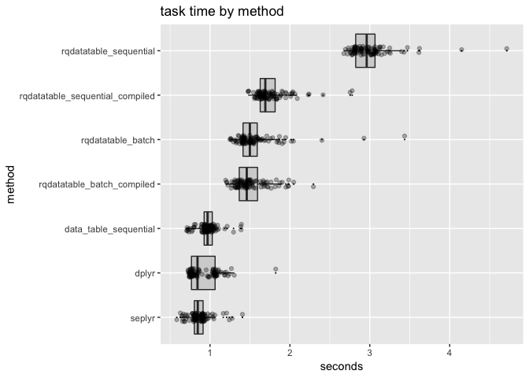

Collecting Expressions, In-Memory Version
================

(In-memory variation of the [Collecting Expressions example](https://github.com/WinVector/rquery/blob/master/extras/CollectExprs.md).)

For in-memory operations sequential operations appear to not be a problem, as they do not contribute to query complexity as in our earlier database examples. This emphasizes that in-memory intuition must be confirmed when working with remote systems.

First set up our packages, database connection, and remote table.

``` r
library("dplyr")
```

    ## Warning: package 'dplyr' was built under R version 3.5.1

    ## 
    ## Attaching package: 'dplyr'

    ## The following objects are masked from 'package:stats':
    ## 
    ##     filter, lag

    ## The following objects are masked from 'package:base':
    ## 
    ##     intersect, setdiff, setequal, union

``` r
library("rquery")
library("microbenchmark")
library("ggplot2")
library("WVPlots")
library("rqdatatable")
library("cdata")
library("data.table")
```

    ## 
    ## Attaching package: 'data.table'

    ## The following objects are masked from 'package:dplyr':
    ## 
    ##     between, first, last

``` r
nrow <- 1000000
d <- data.frame(x = seq_len(nrow))

td <- local_td(d)

tbl <- as.tbl(d)

ncol <- 100
```

[`rqdatatable`](https://CRAN.R-project.org/package=rqdatatable)/[`rquery`](https://CRAN.R-project.org/package=rquery) torture function: add 100 columns to a 1000000 row table. This is implemented using [`data.table`](https://CRAN.R-project.org/package=data.table) in a batch mode.

``` r
rquery_fn_batch <- function(d, ncol) {
  expressions <- paste0("x + ", seq_len(ncol))
  names(expressions) <- paste0("x_", seq_len(ncol))
  ops <- local_td(d) %.>%
    extend_se(., expressions) %.>%
    select_rows_nse(., x == 3)
  d %.>% ops
}

rquery_fn_batch(d, 5)[]
```

    ##    x x_1 x_2 x_3 x_4 x_5
    ## 1: 3   4   5   6   7   8

The row-selection step is to cut down on the in-memory cost of bringing the result back to `R`. Obviously we could optimize the example away by pivoting the filter to earlier in the example pipeline. We ask the reader to take this example as a stand-in for a more complicated (though nasty) real-world example where such optimizations are not available.

A sequentinal versin.

``` r
rquery_fn_seq <- function(d, ncol) {
  ops <- local_td(d) 
  for(i in seq_len(ncol)) {
    ops <- extend_se(ops, paste0("x_", i) %:=% paste0("x + ", i))
  }
  ops <- select_rows_nse(ops, x == 3)
  d %.>% ops
}

rquery_fn_seq(d, 5)[]
```

    ##    x x_1 x_2 x_3 x_4 x_5
    ## 1: 3   4   5   6   7   8

And a pre-compiled `rquery` sequential pipeline.

``` r
rquery_fn_seq_comp <- function(d, ncol) {
  ops <- local_td(d) 
  for(i in seq_len(ncol)) {
    ops <- extend_se(ops, paste0("x_", i) %:=% paste0("x + ", i))
  }
  select_rows_nse(ops, x == 3)
}

ops <- rquery_fn_seq_comp(d, 5)
d %.>% ops
```

    ##    x x_1 x_2 x_3 x_4 x_5
    ## 1: 3   4   5   6   7   8

Same torture for [`dplyr`](https://CRAN.R-project.org/package=dplyr).

``` r
dplyr_fn <- function(tbl, ncol) {
  pipeline <- tbl
  xvar <- rlang::sym("x")
  for(i in seq_len(ncol)) {
    res_i <- rlang::sym(paste0("x_", i))
    pipeline <- pipeline %>%
      mutate(., !!res_i := !!xvar + i)
  }
  pipeline <- pipeline %>%
    filter(., x == 3)
  pipeline %>% compute(.)
}

dplyr_fn(tbl, 5)
```

    ## # A tibble: 1 x 6
    ##       x   x_1   x_2   x_3   x_4   x_5
    ##   <int> <int> <int> <int> <int> <int>
    ## 1     3     4     5     6     7     8

We can also collect expressions efficiently using [`seplyr`](https://CRAN.R-project.org/package=seplyr) (`seplyr` is a thin wrapper over `dplyr`, so `seplyr`'s method [`mutate_se()`](https://winvector.github.io/seplyr/reference/mutate_se.html) is essentially instructions how to do the same thing in batch using `dplyr`/`rlang`).

``` r
seplyr_fn <- function(tbl, ncol) {
  expressions <- paste0("x + ", seq_len(ncol))
  names(expressions) <- paste0("x_", seq_len(ncol))
  pipeline <- tbl %>%
    seplyr::mutate_se(., expressions) %>%
    filter(., x == 3)
  pipeline %>% compute(.)
}

seplyr_fn(tbl, 5)
```

    ## # A tibble: 1 x 6
    ##       x   x_1   x_2   x_3   x_4   x_5
    ##   <int> <dbl> <dbl> <dbl> <dbl> <dbl>
    ## 1     3     4     5     6     7     8

And we can also run with [`data.table`](http://r-datatable.com) either sequentially (as below) or in batch (which was the `rqdatatable` result).

``` r
data_table_sequential_fn <- function(d, ncol) {
  # make sure we have a clean copy
  dt <- data.table::copy(as.data.table(d))
  for(i in seq_len(ncol)) {
    dt[, paste0("x_", i) := eval(parse(text=paste0("x + ", i)))]
  }
  dt[x==3, ]
}

data_table_sequential_fn(tbl, 5)
```

    ##    x x_1 x_2 x_3 x_4 x_5
    ## 1: 3   4   5   6   7   8

Time the functions.

``` r
opsc <- rquery_fn_seq_comp(d, ncol)
timings <- microbenchmark(
  rqdatatable_batch = rquery_fn_batch(d, ncol),
  rqdatatable_sequential = rquery_fn_seq(d, ncol),
  rqdatatable_sequential_compiled = { d %.>% opsc },
  dplyr = dplyr_fn(tbl, ncol),
  seplyr = seplyr_fn(tbl, ncol),
  data_table_sequential = data_table_sequential_fn(d, ncol),
  times = 100L)

saveRDS(timings, "CollectExprs_memory_timings.RDS")
```

Present the results.

``` r
print(timings)
```

    ## Unit: milliseconds
    ##                             expr       min        lq      mean    median
    ##                rqdatatable_batch 1279.1656 1455.2240 1581.3552 1539.5738
    ##           rqdatatable_sequential 2607.6475 2845.1221 2974.1527 2933.4133
    ##  rqdatatable_sequential_compiled 1486.3553 1638.4192 1727.4547 1700.3718
    ##                            dplyr  735.6455  782.3580  913.0006  855.8226
    ##                           seplyr  586.0767  830.4310  892.0809  881.8349
    ##            data_table_sequential  729.6060  936.2447  997.1129  982.9807
    ##         uq      max neval
    ##  1673.0563 2025.577   100
    ##  3038.4283 4385.594   100
    ##  1809.7341 2257.403   100
    ##  1007.5346 1535.456   100
    ##   946.1194 1300.669   100
    ##  1068.9589 1389.268   100

``` r
#autoplot(timings)

timings <- as.data.frame(timings)
timings$seconds <- timings$time/10^9
timings$method <- factor(timings$expr)
timings$method <- reorder(timings$method, timings$seconds)
WVPlots::ScatterBoxPlotH(timings, "seconds", "method", "task time by method")
```



``` r
tratio <- timings %.>%
  project_nse(., 
              groupby = "method", 
              mean_seconds = mean(seconds)) %.>%
  pivot_to_rowrecs(., 
                   columnToTakeKeysFrom = "method", 
                   columnToTakeValuesFrom = "mean_seconds", 
                   rowKeyColumns = NULL) %.>%
  extend_nse(.,
             ratio = dplyr/rqdatatable_batch)

tratio[]
```

    ##    data_table_sequential     dplyr rqdatatable_batch
    ## 1:             0.9971129 0.9130006          1.581355
    ##    rqdatatable_sequential rqdatatable_sequential_compiled    seplyr
    ## 1:               2.974153                        1.727455 0.8920809
    ##        ratio
    ## 1: 0.5773532

``` r
ratio_str <- sprintf("%.2g", 1/tratio$ratio)
```

`rqdatatable` in batch mode is about 1.7 times slower than `dplyr` (and the other sequential implementations and even batch implementations) for this task at this scale for this data implementation and configuration. Likely this is due to copying and re-parsing overhead from `rqdatatable` itself (unlikely to be a `data.table` issue).
