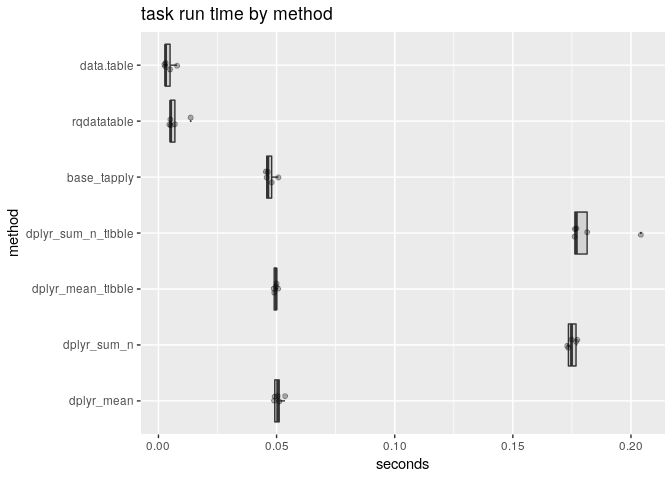

Timing Grouped Mean
================

This note is a comment on some of the timings shared in the dplyr-0.8.0 [pre-release announcement](https://www.tidyverse.org/articles/2018/12/dplyr-0-8-0-release-candidate/).

The original published timings were as follows:

[](https://www.tidyverse.org/articles/2018/12/dplyr-0-8-0-release-candidate/)

With performance metrics: measurements are marketing. So let's dig in the above a bit.

These timings are be of [small task large number of repetition breed](https://cran.r-project.org/web/packages/data.table/vignettes/datatable-benchmarking.html#avoid-microbenchmark...-times100) that Matt Dowle writes against. So they at first wouldn't seem that decisive. Except, look at the following:

-   At the time of our reading the example and methods were not shared. To reproduce the work we will need to make our own example (which we share [here](https://github.com/WinVector/rqdatatable/blob/master/extras/TimingGroupedMean.Rmd)).
-   The timings are not relative to any other package or system (`data.table` and `Pandas` being two obvious choices), so may have trouble valuing the results.
-   The time reported for `dplyr` on the `sum()/n()` examples is over a second to process 10,000 rows. This is unbelievably slow, and we fail to reproduce it in our run.
-   The time reported for `dplyr` on the `mean()` examples is about 0.01 seconds. This is a plausible time for this task (about 3 times as long as `data.table` would take). But it is much faster than is typical for `dplyr`. We fail to reproduce it in our run, we see `dplyr` taking closer to 0.07 seconds on this task (or about seven times slower).

Let's try to reproduce these timings on a 2018 Dell XPS 13 Intel Core i5, 16GB Ram running Ubuntu 18.04, and also compare to some other packages: [`data.table`](https://CRAN.R-project.org/package=data.table) and [`rqdatatable`](https://CRAN.R-project.org/package=rqdatatable).

In this reproduction attempt we see:

-   The `dplyr` time being around 0.05 seconds. This is about 5 times slower than claimed.
-   The `dplyr` `sum()/n()` time is about 0.2 seconds, about 5 times faster than claimed.
-   The `data.table` time being around 0.003 seconds. This is about three times as fast as the `dplyr` claims, and over ten times as fast as the actual observed `dplyr` behavior.

All code for this benchmark is available [here](https://github.com/WinVector/rqdatatable/blob/master/extras/TimingGroupedMean.Rmd) and [here](https://github.com/WinVector/rqdatatable/blob/master/extras/TimingGroupedMean.md).

``` r
library("dplyr")
library("rqdatatable")
library("data.table")
library("microbenchmark")
library("WVPlots")
library("ggplot2")
```

``` r
levels <- sprintf("l_%06g", 
                  seq_len(10000))
d <- data.frame(
  g = rep(levels, 10),
  stringsAsFactors = FALSE)
d$x = runif(nrow(d))
dt <- as.data.table(d)
```

``` r
R.version.string
```

    ## [1] "R version 3.5.1 (2018-07-02)"

``` r
packageVersion("dplyr")
```

    ## [1] '0.7.8'

``` r
packageVersion("rqdatatable")
```

    ## [1] '1.1.2'

``` r
packageVersion("data.table")
```

    ## [1] '1.11.8'

``` r
f_dplyr_mean <- function(d) {
  d %>% 
    group_by(g) %>%
    summarize(x = mean(x))
}

f_dplyr_sum_n <- function(d) {
  d %>% 
    group_by(g) %>%
    summarize(x = sum(x)/n())
}

f_rqdatatable <- function(d) {
  d %.>%
    project_nse(., 
                groupby = "g", 
                x = mean(x))
}

f_data.table <- function(dt) {
  dt[, j = list("x" = mean(x)), by = c("g")]
}
```

``` r
timings = microbenchmark(
  dplyr_mean = f_dplyr_mean(d),
  dplyr_sum_n = f_dplyr_sum_n(d),
  rqdatatable = f_rqdatatable(d),
  data.table = f_data.table(dt),
  times = 10L
)
```

``` r
print(timings)
```

    ## Unit: milliseconds
    ##         expr        min         lq       mean     median         uq
    ##   dplyr_mean  49.044216  49.255479  50.118332  49.613274  51.134114
    ##  dplyr_sum_n 176.818689 177.665255 181.987126 179.174948 180.996072
    ##  rqdatatable   4.542537   4.930214   6.095619   5.016496   5.599747
    ##   data.table   2.425419   2.489957   3.433191   2.874385   3.147625
    ##         max neval
    ##   52.935500    10
    ##  204.358822    10
    ##   13.749040    10
    ##    8.048678    10

``` r
res <- as.data.frame(timings)
res$seconds = res$time/1e+9
res$method = res$expr

res %.>%
  project_nse(.,
              groupby = "method",
              mean_seconds = mean(seconds)) %.>%
  knitr::kable(.)
```

| method        |  mean\_seconds|
|:--------------|--------------:|
| dplyr\_mean   |      0.0501183|
| data.table    |      0.0034332|
| rqdatatable   |      0.0060956|
| dplyr\_sum\_n |      0.1819871|

``` r
WVPlots::ScatterBoxPlotH(
  res, 
  "seconds", "method", 
  "task run time by method")
```



``` r
WVPlots::ScatterBoxPlotH(
  res,  
  "seconds", "method", 
  "task run time by method") + 
  scale_y_log10()
```


Try again at larger data size.

``` r
levels <- sprintf("l_%06g", 
                  seq_len(1000000))
d <- data.frame(
  g = rep(levels, 10),
  stringsAsFactors = FALSE)
d$x = runif(nrow(d))
dt <- as.data.table(d)
```

``` r
timings2 = microbenchmark(
  dplyr_mean = f_dplyr_mean(d),
  dplyr_sum_n = f_dplyr_sum_n(d),
  rqdatatable = f_rqdatatable(d),
  data.table = f_data.table(dt),
  times = 5L
)
```

``` r
print(timings2)

res2 <- as.data.frame(timings2)
res2$seconds = res2$time/1e+9
res2$method = res2$expr

res2 %.>%
  project_nse(.,
              groupby = "method",
              mean_seconds = mean(seconds)) %.>%
  knitr::kable(.)

WVPlots::ScatterBoxPlotH(
  res2, 
  "seconds", "method", 
  "task run time by method (larger example)")

WVPlots::ScatterBoxPlotH(
  res2,  
  "seconds", "method", 
  "task run time by method (larger example)") + 
  scale_y_log10()
```
